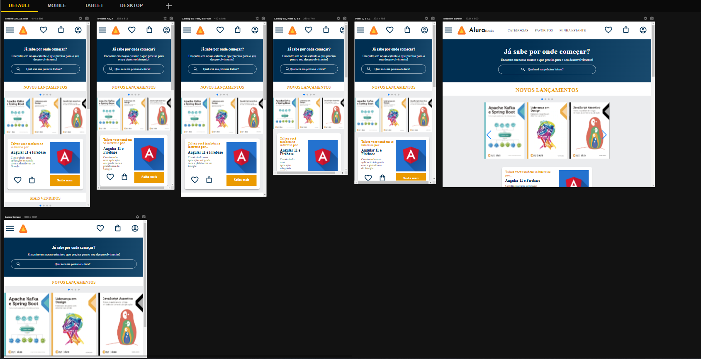

# 

<a href="https://marianayaqi.github.io/alura-books/">

  
  

</a>

<h1 align="center"> Projeto Alura Books</h1>

Esse projeto foi um projeto incrivelmente lindo de criar 
Desenvolvi minhas habilidades no FIGMA, HTML, CSS e pude conhecer um pouquinho do Swiper para desenvolver o carrossel do site. 
Estou muito satisfeita com o resultado e aprendizado em mais esse desafio com a Alura.  
 
Criado junto ao time da  Alura e a professora Monica Hillman (Moni)  👩‍💻

 

  <a href="#-tecnologias">Tecnologias</a>&nbsp;&nbsp;&nbsp;|&nbsp;&nbsp;&nbsp;
  <a href="#-projeto">Projeto</a>&nbsp;&nbsp;&nbsp;|&nbsp;&nbsp;&nbsp;
  <a href="#-layout">Layout</a>&nbsp;&nbsp;&nbsp;|&nbsp;&nbsp;&nbsp;
  <a href="#memo-licença">Licença</a>

  
 

## 🎨 Layout

<h2 align="center">Versões do projeto<h2>
 

  

 

## 💻 Projeto

<a  href="https://marianayaqi.github.io/alura-books/" target="_blank">Clique aqui</a> para conferir o resultado final.

 
<h3>
  🕹️ Este projeto foi desenvolvido por Monica Hilman, do canal Alura<a  href="https://linktr.ee/monicahillman" target="_blank">"Canal Alura".</a>
   

 

## 🤓 Tecnologias

Esse projeto foi desenvolvido com as seguintes tecnologias:

<li> HTML
<li> CSS
<li> FIGMA
<li> Git and GitHub

 
  

## :memo: Licença

Esse projeto está sob a licença MIT.

---

     
<h4> Obrigado por visitar meu Git e se chegou até aqui dê um "FOLLOW" que retribuo, quem sabe não podemos colaborar em algum projeto juntos?
   
  

 Até a próxima! - Bye 😉